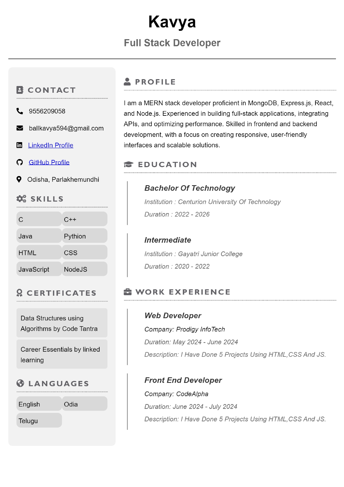
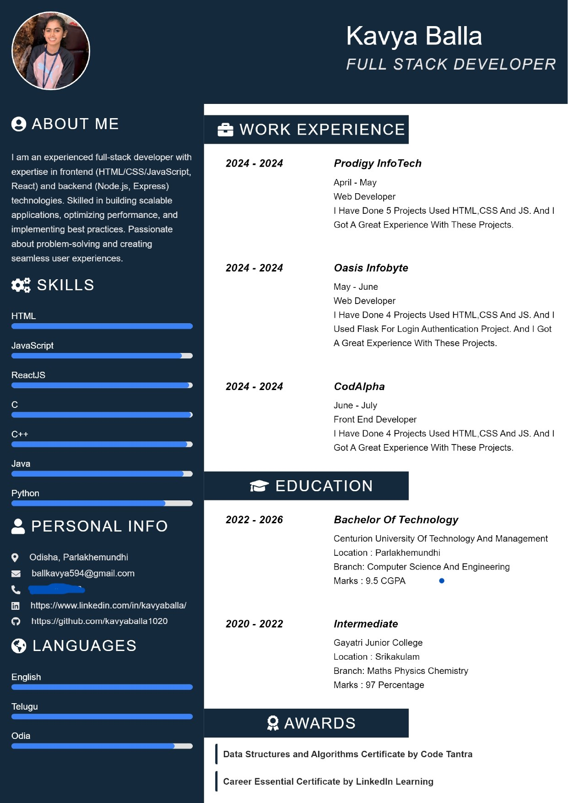

# Dynamic Resume Builder

## Introduction

Welcome to the Dynamic Resume Builder! This application allows users to create professional resumes effortlessly. Choose from two unique styles, customize sections, preview in real-time, and download your resume as a PDF with a single click.

## Features

- **Two Unique Styles:** Create resumes in two different styles.
- **Customizable Sections:** Add and edit personal information, contact details, skills, education, experience, certificates, and languages.
- **Real-Time Preview:** See changes in real-time as you edit your resume.
- **Profile Photo Upload:** Upload your profile photo.
- **PDF Download:** Download your resume as a PDF.

## Live Demo

Check out the live demo [here](https://rb-react.vercel.app/).

## GitHub Repository

Access the project repository on GitHub [here](https://github.com/kavyaballa1020/Resume-Builder-React).

## Getting Started

### Prerequisites

- Node.js (v12 or higher)
- npm or Yarn

### Installation

1. Clone the repository:
   ```bash
   git clone https://github.com/kavyaballa1020/Resume-Builder-React.git
   ```
2. Navigate to the project directory:
   ```bash
   cd Resume-Builder-React
   ```
3. Install dependencies:
   ```bash
   npm install
   # or
   yarn install
   ```

### Running the Application

To start the development server:
```bash
npm start
# or
yarn start
```

The application will be available at `http://localhost:3000`.

### Building for Production

To create a production build:
```bash
npm run build
# or
yarn build
```

## Usage

1. **Home Page:** Start by navigating to the home page where you can choose to create a resume in one of two styles.
   
   
2. **Form:** Fill out the form fields to customize your resume. All changes are reflected in real-time.
   
   

## Skills and Technologies

- **React**
- **JavaScript (ES6+)**
- **HTML & CSS**
- **React Router**
- **Hooks (useState, useEffect)**
- **Custom Hooks**
- **JSX**
- **State Management**
- **Form Handling**
- **File Handling**
- **PDF Generation (jsPDF, html2canvas)**
- **Responsive Design**
- **Git & GitHub**
- **Vercel**
- **npm/Yarn**
- **ESLint/Prettier**

## License

This project is licensed under the MIT License.

## Acknowledgments

Thank you to all the open-source projects and contributors that helped make this application possible.
